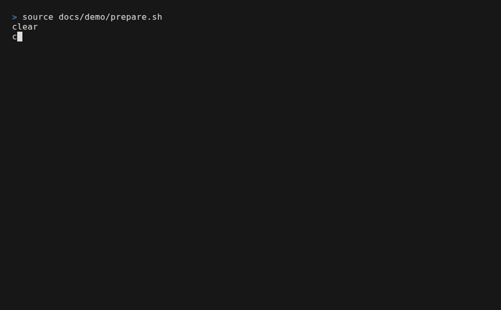

# cfs: isolated Cloud Foundry CLI contexts

[](https://github.com/zongqichen/cfs/actions/workflows/ci.yml)
[](https://github.com/zongqichen/cfs/releases)
[](LICENSE)

Run independent Cloud Foundry CLI targets in parallel.

The official `cf` CLI keeps one active target in `$HOME/.cf`, so switching it in
one terminal changes it for every project. `cfs` isolates that state per project
or Git worktree. Terminals and coding agents can use different foundations,
orgs, and spaces while keeping the normal `cf` command.



*The demo runs the real `cfs` shim with a local, credential-free CF fixture.
[View the source](docs/demo/demo.tape).*

## Quick start

Install the [official CF CLI](https://github.com/cloudfoundry/cli), then download
`cfs` from [GitHub Releases](https://github.com/zongqichen/cfs/releases) or build
it with Go 1.26.8+:

```sh
go install github.com/zongqichen/cfs/cmd/cfs@latest
cfs setup
```

Prebuilt binaries support Linux and macOS on x86-64 and arm64. Put the shim
directory printed by `cfs setup` first on `PATH`, open a new shell, and run
`cfs doctor`.

Now log in normally from each project:

```sh
cd ~/work/orders
cf login --sso -a https://api.example.com -o commerce -s development
cf apps
```

Another project or Git worktree receives a separate context automatically.
Terminals and agents in the same worktree intentionally share its context.

## Existing login

To copy your current global CF target into a workspace once:

```sh
cd ~/work/orders
CFS_DISABLE=1 cf target
cfs import
```

The import is a private snapshot, not a link. It may contain active credentials.
Use `cfs import --yes` in non-interactive automation and `--force` only when you
intend to replace an existing workspace target. `cfs` never imports credentials
silently.

## Coding agents

No agent integration is required. Start Codex, Claude Code, or an IDE agent in
its project or worktree and let it run ordinary `cf` commands. For diagnostics
safe to attach to agent logs, use:

```sh
cfs status --json --redact
```

## How it works

```text
cf command -> cfs shim -> workspace-specific CF_HOME -> official cf CLI
```

`cfs setup` places a transparent `cf` shim on `PATH`. For each invocation, the
shim resolves the current workspace, selects its private state, and delegates to
the official CLI. Authentication, token refresh, plugins, API calls, signals,
and exit codes remain the official CLI's responsibility.

Git worktrees are detected automatically. For a directory that is not a Git
worktree, create this marker at its root:

```toml
version = 1
```

Alternatively, select a workspace for one command:

```sh
CFS_WORKSPACE_ROOT=/workspace cf apps
```

## Commands

```text
cfs setup           Install the transparent cf shim
cfs status          Show the current workspace and target
cfs import          Import the global context into this workspace
cfs doctor          Diagnose the installation and workspace
cfs reset           Move this workspace's state to trash
cfs gc              Find stale workspace state
cfs uninstall       Remove the shim without deleting state
cfs version         Print version information
cfs help [command]  Show help
```

Use `CFS_DISABLE=1 cf ...` to bypass isolation for one command. `cfs` collects no
telemetry. Workspace state and recoverable trash can contain active tokens; see
[Security](SECURITY.md).

## Development

```sh
make check
make security
make release-check
make smoke
CFS_REAL_CF=/path/to/official/cf make e2e
```

See [testing](docs/testing.md), [design](docs/design.md), the
[changelog](CHANGELOG.md), and the [release guide](docs/releasing.md).
Contributions are welcome; read
[CONTRIBUTING.md](CONTRIBUTING.md). Licensed under [Apache-2.0](LICENSE), like
the official CF CLI.
